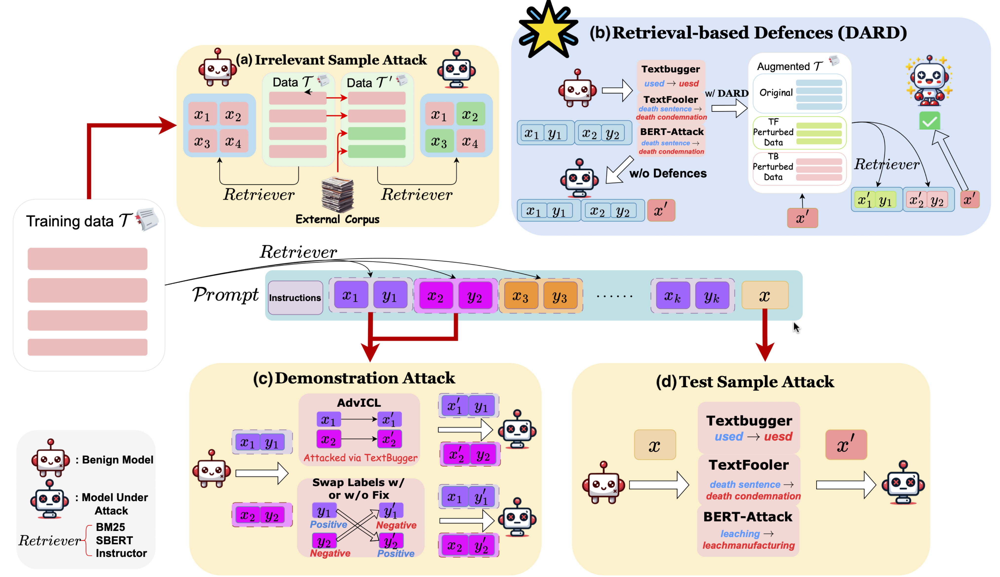

# adv-retreival-icl
Codebase for the paper [Evaluating the Adversarial Robustness of Retrieval-Based In-Context Learning for Large Language Models](https://arxiv.org/abs/2405.15984)




### 0. Installation
```bash
conda create -n adv-retrieval-icl python=3.8
pip install -r requirements.txt

pip install -e git+https://github.com/simonucl/TextAttack.git#egg=TextAttack
```
Following the above instructions with the installed egg package for running experiments

### 1. Running Main Experiments
```bash
MODEL=meta-llama/Llama-2-7b-hf
# Vanilla ICL
bash scripts/icl/attack.sh \
      [sst2|rte|mnli|cr|mr|trec] \
      $MODEL \
      icl \
      textfooler

# kNN-ICL

# Retrieval-base ICL
bash scripts/ralm/attack.sh
```

### 2. Running Ablation Experiments

### 3. Citation
```bib
@misc{yu2024evaluatingadversarialrobustnessretrievalbased,
      title={Evaluating the Adversarial Robustness of Retrieval-Based In-Context Learning for Large Language Models}, 
      author={Simon Chi Lok Yu and Jie He and Pasquale Minervini and Jeff Z. Pan},
      year={2024},
      eprint={2405.15984},
      archivePrefix={arXiv},
      primaryClass={cs.CL},
      url={https://arxiv.org/abs/2405.15984}, 
}
```